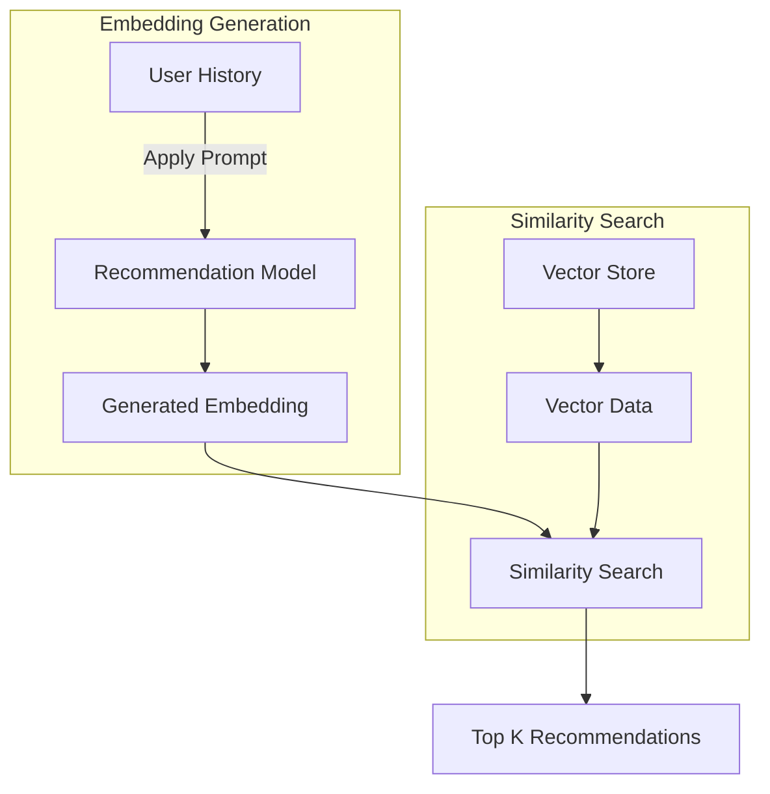
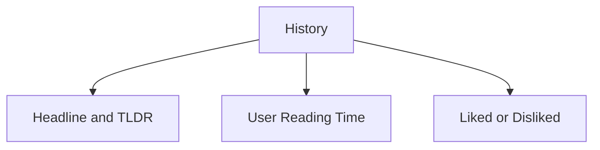
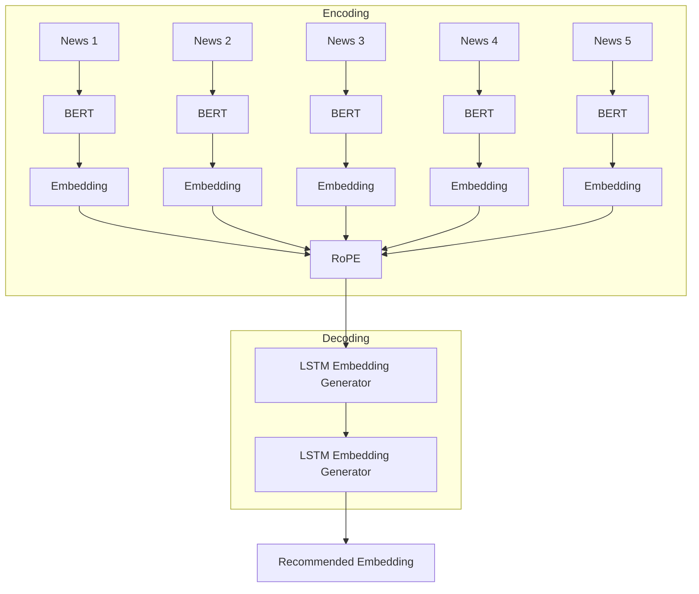

# News Recommendation Algorithm

## Version: rec_v1.0.0

### Overview

This recommendation system suggests news articles based on a user's previously read news history. It leverages embeddings, similarity search, and a predictive model to enhance the user experience.

## Architecture

### Recommendation Pipeline



### User History



- **History** consists of a time series of the last `n` news articles read by the user.
  - In the code, `n` is referred to as `timeseries`, which is currently set to 5.
  - The model expects the last `n` articles read by the user as input.
- Data is accepted in JSON format (see [main.py](main.py)).

#### Example JSON Input

```json
[
	{
		"NewsTitle": "",
		"NewsTLDR": "",
		"Liked": ""
	},
	{
		"NewsTitle": "",
		"NewsTLDR": "",
		"Liked": ""
	},
	{
		"NewsTitle": "",
		"NewsTLDR": "",
		"Liked": ""
	},
	{
		"NewsTitle": "",
		"NewsTLDR": "",
		"Liked": ""
	},
	{
		"NewsTitle": "",
		"NewsTLDR": "",
		"Liked": ""
	}
]
```

## Recommendation Model

### Model Architecture



### Functionality

- The `recommendationModel` predicts the embedding of the next news article a user is likely to read
- Using `FAISS`, finds the similar news with the generated news embedding.
- `FAISS` retrives top_k news similar to the generated embedding.
